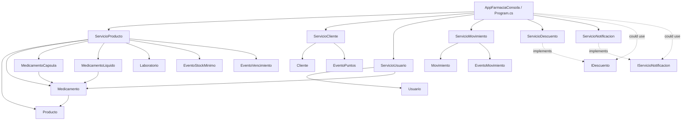

# Diagrama de Dependencias

```mermaid
flowchart TD
    %% Composition root
    Program[AppFarmaciaConsola / Program.cs]

    %% High-level modules
    SP[ServicioProducto]
    SC[ServicioCliente]
    SU[ServicioUsuario]
    SM[ServicioMovimiento]
    SD[ServicioDescuento]
    SN[ServicioNotificacion]

    %% Abstractions
    ID[IDescuento]
    IN[IServicioNotificacion]

    %% Domain / entities
    P[Producto]
    M[Medicamento]
    MC[MedicamentoCapsula]
    ML[MedicamentoLiquido]
    C[Cliente]
    U[Usuario]
    L[Laboratorio]
    Mov[Movimiento]

    %% Events
    ES[EventoStockMinimo]
    EV[EventoVencimiento]
    EP[EventoPuntos]
    EM[EventoMovimiento]

    %% Composition root wiring
    Program --> SP
    Program --> SC
    Program --> SU
    Program --> SM
    Program --> SD
    Program --> SN

    %% Services depend on domain
    SP --> P
    SP --> M
    SP --> MC
    SP --> ML
    SP --> L
    SP --> ES
    SP --> EV

    SC --> C
    SC --> EP

    SU --> U
    SU --> M

    SM --> Mov
    SM --> EM

    %% Inversion of dependency
    SD -.implements.-> ID
    SN -.implements.-> IN

    %% In practice, no consumer injection visible
    Program -.could use.-> ID
    Program -.could use.-> IN

    %% Inheritance relations
    M --> P
    MC --> M
    ML --> M
```
